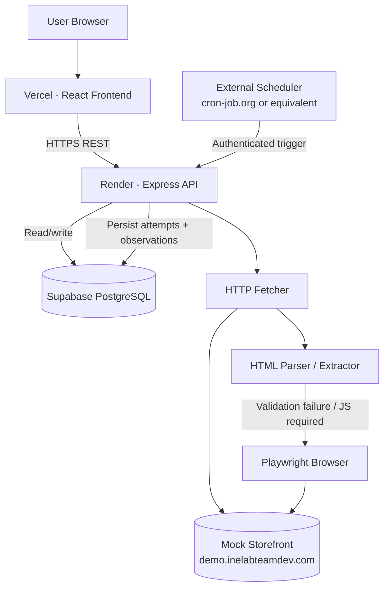
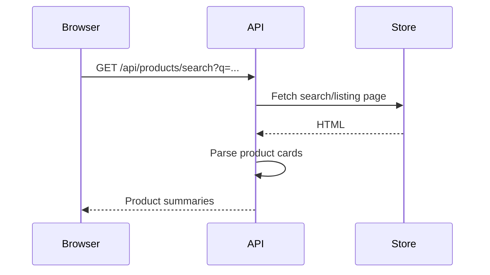
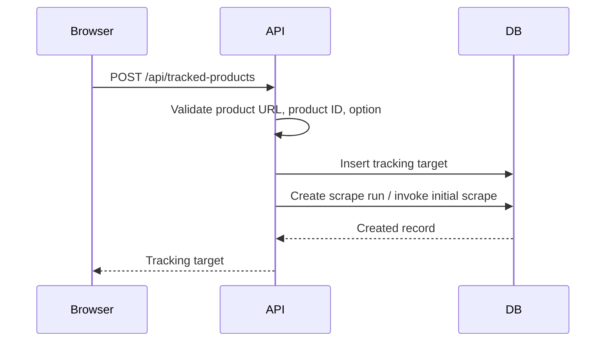
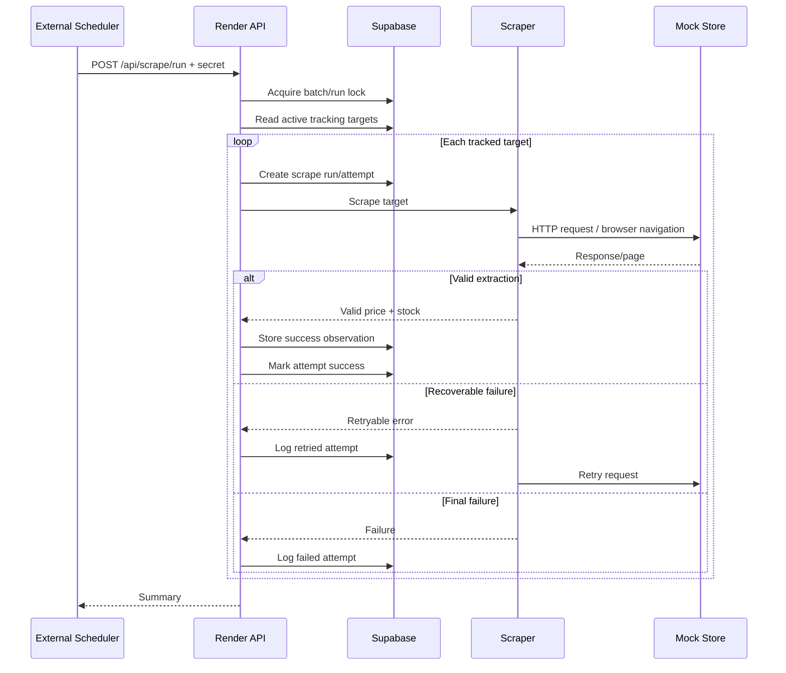

# Architecture

## 1. Architecture Summary

The proposed system is a small modular monolith:

- React + Vite frontend deployed on Vercel
- Node.js + Express backend deployed on Render
- Supabase PostgreSQL for persistence
- cron-job.org (or equivalent external scheduler) triggering the backend every 2 hours
- HTTP fetch + Cheerio-style HTML parsing as the first scraping strategy
- Playwright as the fallback for pages that genuinely require browser rendering

The architecture deliberately keeps the scraper inside the backend codebase but separates it into independent modules. This minimizes deployment and coordination overhead for a time-boxed assignment while preserving clean boundaries.

## 2. High-Level Diagram



## 3. Runtime Workflows

### 3.1 Product Search



Design note: search can be implemented as backend scraping or against a small synchronized catalog if the target storefront supports stable product discovery. Do not make the frontend scrape the storefront directly.

### 3.2 Track Product



Recommended behavior: return the created tracking record quickly and perform the initial scrape through a background-safe mechanism when practical. For the assignment scale, a synchronous initial scrape is acceptable if request timeout limits are respected, but the scheduled path must remain independently executable.

### 3.3 Scheduled Scrape Batch



## 4. Service Boundaries

### Frontend

Responsibilities:

- Search UX
- Product/variant selection
- Tracking list
- History chart/table
- Scrape logs
- CSV export action
- Manual scrape/demo controls if exposed

Do not:

- Store Supabase service-role credentials
- Scrape the storefront directly
- Decide whether a price is valid

### Backend API

Responsibilities:

- HTTP routing
- Input validation
- Tracking CRUD
- Querying historical data
- Export generation
- Scheduler authentication
- Scrape orchestration
- Data integrity rules
- Error normalization

### Scraper Module

Responsibilities:

- HTTP request execution
- Browser execution when necessary
- Product-page navigation
- Variant selection
- Price extraction
- Stock extraction
- Validation
- Retry classification
- Scraper diagnostics

### Persistence Module

Responsibilities:

- Transactions
- Inserts/updates
- Query composition
- Uniqueness guarantees
- Run/attempt state transitions

## 5. Scraper Design

### 5.1 Strategy

Use a layered strategy:

1. HTTP request.
2. Parse HTML.
3. Validate required product identity, option, price, stock.
4. If required content is absent because it is rendered client-side, use Playwright.
5. If extraction is still invalid, fail the attempt honestly.

### 5.2 Do Not Use Arbitrary Sleeps

Prefer event- or condition-based waits:

- element becomes visible
- expected text appears
- DOM reaches a known state
- response/network condition completes

Playwright locators are designed around auto-waiting/retry behavior, which is preferable to large fixed sleeps when browser automation is required. [Playwright locators](https://playwright.dev/docs/locators)

### 5.3 Retry Policy

Proposed defaults:

| Parameter | Proposed value |
|---|---:|
| Max attempts | 3 |
| Initial delay | 1 second |
| Backoff | exponential |
| Jitter | yes |
| Request timeout | 10–15 seconds HTTP; browser navigation/action timeouts separately |
| Retry on | network error, timeout, 408, 429, 5xx, temporary browser navigation failure |
| Do not retry | invalid selector result, product not found, option not found, malformed extraction |

These values are project decisions and should be tuned after observing the mock store.

### 5.4 Extraction Validation

A scrape result is valid only if all required fields pass checks:

```text
product id matches tracked target
AND product name is non-empty
AND selected option is identified
AND price is numeric and >= 0
AND stock is one of the supported normalized states
```

If any required check fails, no successful history record is written.

### 5.5 Stock Normalization

Use a normalized representation:

- `in_stock`
- `out_of_stock`
- `unknown`

The raw stock text may also be stored in the scrape attempt for diagnostics.

### 5.6 Price Normalization

Persist price as a PostgreSQL `numeric(12,2)` value when the store returns a monetary decimal. Never store formatted currency strings in the primary price column.

## 6. Failure Isolation

Pseudo-code:

```js
for (const target of activeTargets) {
  try {
    await scrapeOneTarget(target);
  } catch (error) {
    await recordFinalFailure(target, error);
  }
}
```

One target's failure must not abort the batch.

## 7. Scheduler and Free-Tier Behavior

The assignment explicitly requires an external cron service or scheduled function because free-tier backends may sleep. cron-job.org is the simplest assignment-aligned option.

An alternative is a Render Cron Job. Render currently supports cron jobs as a service type and exposes run history/logs, but this may introduce deployment/billing considerations. [Render Cron Jobs](https://render.com/docs/cronjobs)

Recommended assignment implementation:

```text
cron-job.org
   ↓ every 2 hours
POST /api/scrape/run
   ↓
Render Web Service
   ↓
Supabase + scraper
```

The endpoint must be protected by a scheduler secret.

## 8. Concurrency / Idempotency

A scheduled trigger can be retried by the scheduler or manually invoked. The system therefore needs a logical run identity.

Recommended fields:

- `run_id`
- `target_id`
- `attempt_number`
- `started_at`
- `finished_at`

Recommended protection:

- Acquire an application-level run lock before batch execution.
- Do not create a second successful observation for the same target and logical run.
- Use database uniqueness constraints where practical.

At assignment scale, a PostgreSQL advisory lock or a short-lived database lock can be considered. Keep the implementation small and documented.

## 9. API Error Handling

Express supports middleware-based error handling and asynchronous handler error propagation. Use a central error middleware after the route stack. [Express error handling](https://expressjs.com/en/guide/error-handling.html)

Recommended error shape:

```json
{
  "error": {
    "code": "TRACKING_TARGET_NOT_FOUND",
    "message": "Tracked product was not found.",
    "requestId": "..."
  }
}
```

Do not return stack traces to public clients.

## 10. Deployment Architecture

### Vercel

- Build frontend
- Configure `VITE_API_BASE_URL` or equivalent public API URL
- No database service keys in frontend environment

### Render

- Node.js Express service
- `PORT` supplied by platform
- `SUPABASE_DATABASE_URL` or Supabase connection configuration
- `SCRAPE_TRIGGER_SECRET`
- Playwright browser dependencies installed as part of deployment if browser mode is used

### Supabase

- PostgreSQL schema
- Tables from `DATABASE.md`
- Server-side credentials only
- Enable database security controls appropriate to the chosen access model

## 11. Repository Structure

```text
price-tracker/
├── frontend/
│   ├── src/
│   │   ├── components/
│   │   ├── pages/
│   │   ├── hooks/
│   │   ├── lib/
│   │   └── api/
│   ├── public/
│   └── package.json
├── backend/
│   ├── src/
│   │   ├── app.js
│   │   ├── server.js
│   │   ├── routes/
│   │   ├── controllers/
│   │   ├── services/
│   │   ├── scraper/
│   │   │   ├── httpFetcher.js
│   │   │   ├── browserFetcher.js
│   │   │   ├── parser.js
│   │   │   ├── validators.js
│   │   │   └── retry.js
│   │   ├── db/
│   │   ├── middleware/
│   │   └── utils/
│   ├── tests/
│   └── package.json
├── fixtures/
│   ├── product-page-success.html
│   ├── product-page-missing-price.html
│   └── product-page-dynamic.html
├── docs/
│   ├── PRD.md
│   ├── ARCHITECTURE.md
│   ├── API.md
│   ├── DATABASE.md
│   ├── DECISION.md
│   ├── TASK.md
│   └── RESEARCH.md
└── README.md
```

## 12. Testing Architecture

```text
Parser unit tests
    ↓
Scraper service tests
    ↓
API integration tests
    ↓
Database integration tests
    ↓
Production smoke test
    ↓
Manual headed-run demonstration
```

Fixtures are important because selector/page parsing bugs should be testable without repeatedly hitting the live target store.
