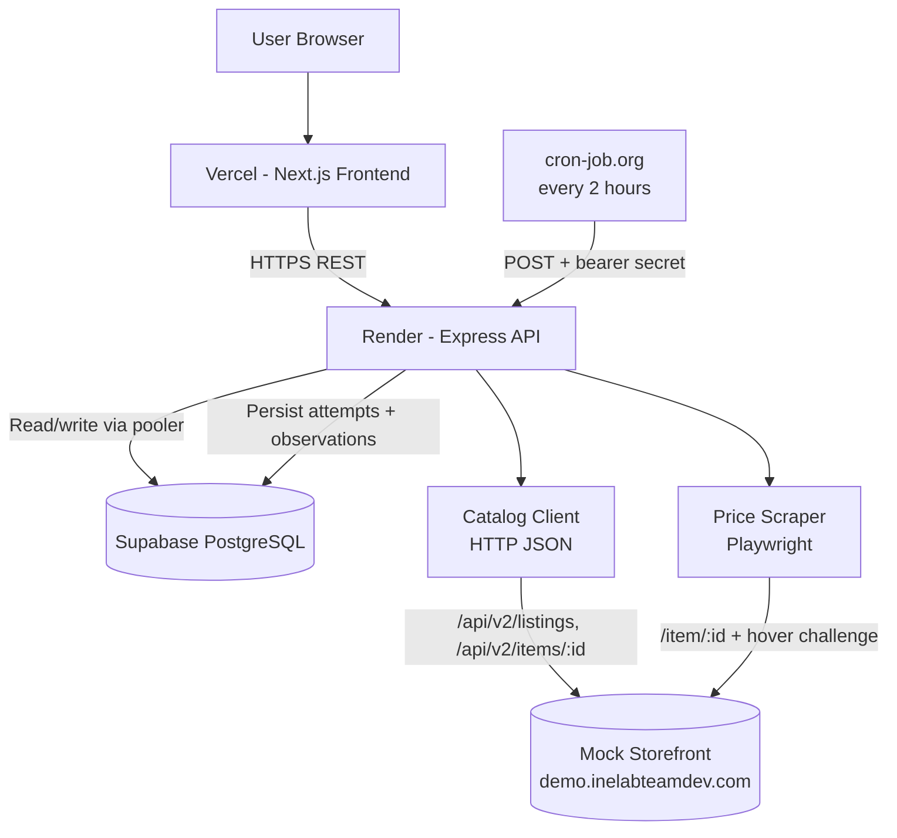
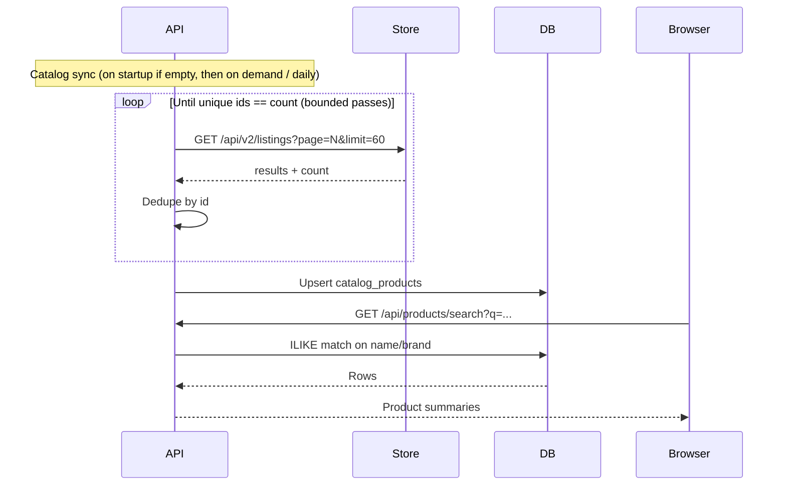
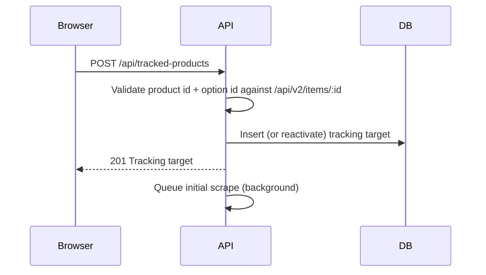
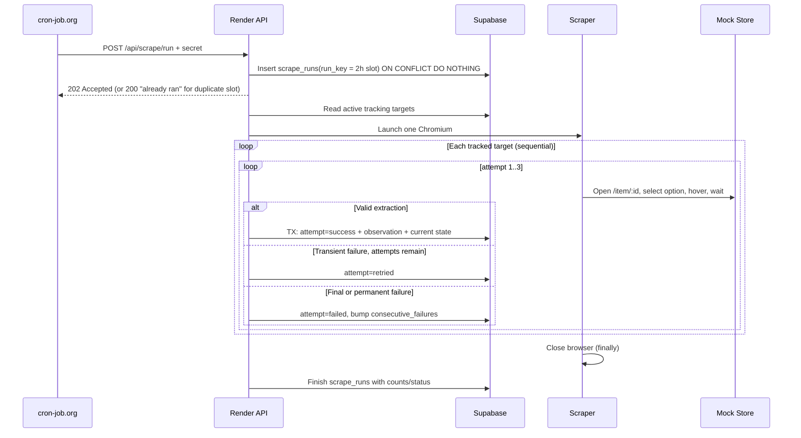

# Architecture

## 1. Architecture Summary

The system is a small modular monolith:

- Next.js 16 frontend (React 19, App Router) deployed on Vercel
- Node.js + Express backend deployed on Render (free web service)
- Supabase PostgreSQL for persistence, accessed server-side through the Supabase pooler
- cron-job.org triggering the backend every 2 hours
- **Plain HTTP against the store's JSON API** for catalog search and product options
- **Playwright** for price and stock, because the store only reveals them after a browser-side challenge (see §5.1)

The scraper lives inside the backend codebase but is split into independent modules. This keeps deployment simple for a time-boxed assignment while preserving clean boundaries.

## 2. High-Level Diagram



## 3. Runtime Workflows

### 3.1 Catalog Sync and Product Search

The store has no working server-side search (`q` is ignored), and `/api/v2/listings` returns products in a **different random order on every request**. Paging through all pages once returned only 617 of 960 products. Searching by paging live would silently miss products.

Therefore search runs against a local catalog cache:



The sync repeats full passes until the set of unique IDs reaches the reported `count` or a pass limit is hit. It records whether the catalog is complete. Search results come from the database, so search is fast and does not depend on the store's availability.

### 3.2 Product Detail and Option Selection

```text
GET /api/products/:storeProductId
   → HTTP GET /api/v2/items/:id
   → { id, name, brand, category, sku, specs, optionAxis, options: [{ id, label }] }
```

The option `id` (e.g. `o1`) is the stable option key. The `label` (e.g. `Oak`) is shown to the user.

### 3.3 Track Product



The initial scrape runs in the background so the request does not wait on Playwright.

### 3.4 Scheduled Scrape Batch



## 4. Service Boundaries

### Frontend

Responsibilities:

- Search UX
- Product/option selection
- Tracking list
- History chart/table
- Scrape logs
- CSV export action

Do not:

- Store database or Supabase service credentials
- Call the storefront directly
- Decide whether a price is valid

### Backend API

Responsibilities:

- HTTP routing
- Input validation
- Tracking CRUD
- Querying historical data
- Export generation
- Scheduler authentication
- Scrape orchestration
- Data integrity rules
- Error normalization

### Store Client Module (HTTP)

- Listings pagination + catalog sync
- Product detail/options
- UI manifest fetch (current CSS class names)
- Timeouts, retry on 429/5xx

### Price Scraper Module (Playwright)

- Browser lifecycle
- Product-page navigation
- Option selection
- Human-like hover to satisfy the price challenge
- Price/stock extraction via manifest classes
- Validation
- Retry classification
- Diagnostics (screenshot/DOM snapshot on failure, locally)

### Persistence Module

- Transactions
- Inserts/updates
- Query composition
- Uniqueness guarantees
- Run/attempt state transitions

## 5. Scraper Design

### 5.1 Why a Browser Is Required for Price and Stock

Verified by inspecting the store (see `research.md`):

1. `/` and `/item/:id` return an empty SPA shell, so there is nothing to parse.
2. `/api/v2/items/:id` returns name, specs, reviews and options, but **no price or stock**.
3. The price is fetched by the page's own JavaScript only after:
   - a proof-of-work challenge computed in the browser,
   - mouse-hover telemetry over the price panel (a minimum number of moves and a minimum dwell time, recorded from trusted input events),
   - exchanging that for a short-lived token and fetching an encoded price payload.
4. Until then the page shows "Hover over the price area to load the current price." or "Hold on — checking availability…".

Reproducing steps 3a–c over plain HTTP would mean reverse-engineering obfuscated code that can change at any time. Driving a real browser and letting the page do its own work is more robust and matches the brief's "headless browser only where the page genuinely requires it".

### 5.2 Strategy

| Data | Method | Why |
|---|---|---|
| Catalog / search | HTTP JSON (`/api/v2/listings`) → DB cache | Cheap and complete, with no browser needed |
| Product options | HTTP JSON (`/api/v2/items/:id`) | Stable ids/labels |
| CSS class map | HTTP JSON (`/api/v2/ui/manifest`) | Needed to locate price/stock in the DOM |
| Price + stock | Playwright | Gated behind browser challenge + hover |

### 5.3 Price Extraction Procedure (Playwright)

1. Use the manifest **the page itself loaded** (captured from its `/api/v2/ui/manifest` response) → `classes.priceValue`, `classes.stock`, `classes.mrp`, `priceTag`, `revision`. A manifest fetched over HTTP at batch start is the fallback, so a rotation between our fetch and the page's cannot cause a mismatch.
2. Open `/item/:id`; wait for the product name to match the tracked name.
3. Dismiss the cookie-consent overlay (**Reject**) if it appears; it blocks all pointer input.
4. Select the tracked option chip by label and confirm `aria-pressed="true"` (re-click if the event was dropped).
5. Move the mouse into the price panel (`.offer-panel`) with many `page.mouse.move` steps until the `Check today's price` button enables, then click it.
6. Wait for the panel to be `offer-ready` and the price element `<priceTag>.<priceValue>` to be visible **and** not pending (the page dims the price to `opacity: 0.45` while loading). Confirm the quote request's `opt=` equals the tracked option key.
7. Read the text of the single visible price element. **Never** read the hidden `.price-value` or `.amount[data-price]` spans, which are decoys.
8. Normalize: strip zero-width spaces (`​`), NBSP, currency symbol and Indian digit grouping (`1,29,999.00` → `129999.00`).
9. Read the stock element: a count pill (`avail-yes`) or `Sold out` (`avail-no`) → integer quantity (0 = sold out). The count pill uses one of five wordings (`7 units available`, `Last few: 7`, `Available (7)`, `Stock: 7 remaining`, `Ready to ship · 7 available`). Extract the single integer, and fail validation if there is not exactly one.
10. Validate (§5.6). If valid, return a structured result.

Use locator auto-waiting and explicit conditions, not fixed sleeps. The only intentional delay is the hover dwell the page itself requires. [Playwright locators](https://playwright.dev/docs/locators)

### 5.4 Which Price Is Tracked

The page may show MRP (struck-through), a sale price, and a member price. The tracked price is **the main displayed price (`priceValue`)**, i.e. what a normal customer pays. MRP is stored as extra info when available. Member price is ignored.

### 5.5 Retry Policy

| Parameter | Value |
|---|---:|
| Max attempts per target per run | 3 |
| Backoff | exponential, 2 s base, with jitter |
| HTTP timeout | 15 s |
| Browser navigation timeout | 30 s |
| Price-ready timeout | 20 s |

| Classification | Examples | Action |
|---|---|---|
| Transient | network error, timeout, HTTP 408/429/5xx, challenge never completes, price never appears, hover dropped | retry |
| Page shifted | price/stock locator not found, manifest revision changed mid-run | retry with fresh page **and** fresh manifest; log `error_code=STRUCTURE_CHANGED` |
| Permanent | product 404, tracked option no longer offered, name mismatch | fail immediately |

Selector misses are retried because on this store they are usually temporary (late content, dropped hover events, rotating classes). The brief asks the scraper to "recover when … a page shifts". If a miss persists across all attempts, the attempt is logged as `failed` with `STRUCTURE_CHANGED`, which feeds the structure-change bonus.

### 5.6 Extraction Validation

A result is valid only if all checks pass:

```text
product name on page matches tracked product
AND active option label == tracked option label
AND price element is visible and not pending
AND price source is not the hidden decoy element
AND normalized price is a finite number > 0
AND stock is an integer >= 0
```

If any check fails, no successful history row is written.

### 5.7 Stock and Price Normalization

- `stock_qty` integer (0 = sold out). `stock_status` is derived (`in_stock` / `out_of_stock`) for display.
- Price stored as `numeric(12,2)` plus `currency` (from the page, expected `INR`). Never store formatted strings in the price column.
- Raw price and stock text are kept on the attempt row for diagnostics.

## 6. Failure Isolation

```js
const browser = await chromium.launch({ headless: !headed });
try {
  for (const target of activeTargets) {
    try {
      await scrapeWithRetries(browser, target, run);
    } catch (error) {
      await recordFinalFailure(target, run, error);
    }
  }
} finally {
  await browser.close();
}
```

One target's failure must not abort the batch. Each target gets a fresh browser context, so state (cookies, tokens) does not leak between targets.

## 7. Scheduler and Free-Tier Behavior

```text
cron-job.org  every 10 min   GET /api/health          → keeps Render awake (no idle sleep)
UptimeRobot   every 5 min    GET /api/health          → backup ping + downtime email
cron-job.org  :00 even hours POST /api/scrape/run     → instance already warm
   ↓ 202 Accepted immediately
background batch → Playwright → Supabase
```

Constraints that shape this:

- **cron-job.org timeout (~30 s):** shorter than both a cold start and a batch. The instance is kept warm (the brief: "keep the instance warm if needed"), so the scrape call never waits on a cold start. The scrape endpoint then responds `202` and runs in the background.
- **Render free sleeps after ~15 min idle:** a single warm-up ping 5 minutes before each scrape was the first design. In production the logs showed the instance being stopped (`SIGTERM`) ~15 minutes after every start, so it now gets a health ping every 10 minutes and never goes idle. One always-on free service fits within Render's monthly free hours.
- **Restarts mid-batch:** on `SIGTERM` the server stops accepting requests and waits up to 45 s for an in-flight scrape before closing the database pool. A batch that still gets cut off is closed as `failed` by the next run.
- **512 MB RAM:** one Chromium, sequential targets, new context per target, browser always closed in `finally`. Block images/fonts to save memory.
- **Supabase direct connection is IPv6-only; Render has no outbound IPv6:** connect via the Supabase **session pooler** string.

Alternative considered: Render Cron Job (a separate service type, not part of the free plan) or GitHub Actions `schedule` (can be delayed/skipped under load). cron-job.org is the assignment's suggested option. [Render Cron Jobs](https://render.com/docs/cronjobs)

## 8. Concurrency / Idempotency

- `run_key` = trigger source + 2-hour UTC slot, e.g. `cron-2026-09-25T10`. `UNIQUE(run_key)` means a duplicate cron call for the same slot is a no-op.
- Manual/demo runs use `manual-<uuid>` and are always allowed.
- An in-process flag prevents two batches running at once in the same instance. A PostgreSQL advisory lock (`pg_try_advisory_lock`) guards across instances.
- `UNIQUE(tracked_product_id, run_id, attempt_number)` prevents duplicate attempt rows.

### 8.1 Never Silently Stop

The brief says the scraper must "never silently stop". Failures inside a run are already logged per attempt. Two further ways it could stop silently are covered:

| Silent stop | Detection / recovery |
|---|---|
| Scheduler stops firing, or Render is down when it fires | `/api/health` returns `lastCronRunAt` and `schedulerStale = true` when no cron run started in the last 2 h 30 min. The dashboard shows a banner. cron-job.org failure notifications are enabled. |
| Instance crashes/restarts mid-batch, leaving a run `running` | At the start of every run, runs `running` for more than 30 min are marked `failed` with `finished_at = now()`. The run list shows them honestly. |
| A target keeps failing every run | `consecutive_failures` is shown on the dashboard, highlighted at 3 or more. |

## 9. API Error Handling

Express 5 forwards rejected promises from async handlers to error middleware. Use one central error middleware after the routes. [Express error handling](https://expressjs.com/en/guide/error-handling.html)

```json
{
  "error": {
    "code": "TRACKING_TARGET_NOT_FOUND",
    "message": "Tracked product was not found.",
    "requestId": "..."
  }
}
```

Do not return stack traces to public clients.

## 10. Deployment Architecture

### Vercel

- Next.js project, root directory `frontend/`
- `NEXT_PUBLIC_API_BASE_URL` → Render API URL
- No database credentials in frontend environment

### Render

- Web service, root directory `backend/`
- Build: `npm install && npx playwright install --with-deps chromium`
- `PORT` supplied by platform
- `DATABASE_URL` (Supabase session pooler), `SCRAPE_TRIGGER_SECRET`, `FRONTEND_ORIGIN`, timeouts

### Supabase

- Schema from `backend/db/schema.sql`
- Server-side access only (no browser → Supabase access)
- RLS enabled with no public policies, so the anon key has no access even if leaked

## 11. Repository Structure

```text
price-tracker/
├── frontend/                     Next.js 16 (App Router, JS, Tailwind 4)
│   ├── app/
│   │   ├── layout.js
│   │   ├── page.js               dashboard
│   │   └── products/[id]/page.js tracked product detail (history + log)
│   ├── components/
│   ├── lib/api.js                fetch wrapper using NEXT_PUBLIC_API_BASE_URL
│   └── package.json
├── backend/
│   ├── src/
│   │   ├── app.js
│   │   ├── server.js
│   │   ├── routes/
│   │   ├── services/
│   │   ├── store/                HTTP client: listings, items, manifest, catalog sync
│   │   ├── scraper/
│   │   │   ├── browser.js        launch/context lifecycle
│   │   │   ├── priceScraper.js   navigate, select option, hover, read
│   │   │   ├── normalize.js      price/stock text → numbers
│   │   │   ├── validate.js
│   │   │   ├── classify.js       transient / structure / permanent
│   │   │   └── retry.js
│   │   ├── db/
│   │   ├── middleware/
│   │   └── cli/scrapeHeaded.js   local headed run
│   ├── db/schema.sql
│   ├── tests/
│   └── package.json
├── fixtures/
│   ├── manifest-*.json
│   ├── item-*.json
│   └── product-dom-*.html        rendered DOM snapshots (after price load)
├── docs/
└── README.md
```

## 12. Testing Architecture

```text
normalize/validate unit tests (fixtures: split prices, INR grouping, sold out, decoy)
    ↓
classifier + retry tests
    ↓
catalog sync tests (shuffled pages, dedupe, completeness)
    ↓
API integration tests
    ↓
Database integration tests (success TX, failure leaves current state)
    ↓
Live smoke test against the store
    ↓
Manual headed-run demonstration
```

Fixtures let parser bugs be tested without repeatedly hitting the live store.
