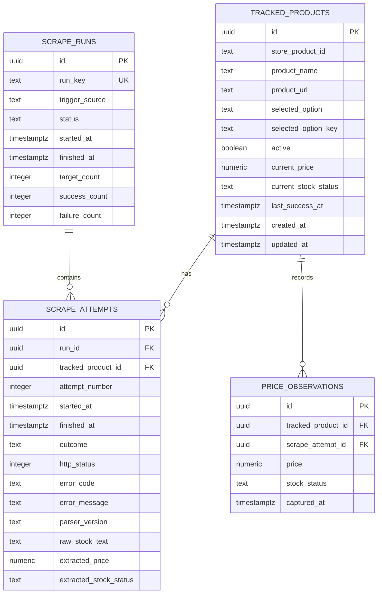

# Database Design

## 1. Database Choice

PostgreSQL on Supabase is required by the assignment.

The schema is intentionally relational because a tracking target has a stable identity, while scrape runs and observations form a one-to-many history.

## 2. Entity Relationship Diagram



## 3. Table: `tracked_products`

Purpose: immutable-ish identity of what the user wants to track.

Suggested columns:

| Column | Type | Notes |
|---|---|---|
| `id` | uuid | PK |
| `store_product_id` | text | Store product ID from product page URL |
| `product_name` | text | Snapshot of product name |
| `product_url` | text | Target store URL |
| `selected_option` | text | Human-readable selected option |
| `selected_option_key` | text | Stable option key when available |
| `active` | boolean | Soft-disable tracking |
| `current_price` | numeric(12,2) | Last successful price only |
| `current_stock_status` | text | Last successful stock state |
| `last_success_at` | timestamptz | Last validated observation |
| `last_attempt_at` | timestamptz | Last attempt regardless of outcome |
| `last_outcome` | text | Last assignment outcome |
| `consecutive_failures` | integer | Operational summary |
| `created_at` | timestamptz | Default now |
| `updated_at` | timestamptz | Updated by backend |

## 4. Table: `scrape_runs`

Purpose: batch-level execution metadata.

Suggested columns:

| Column | Type | Notes |
|---|---|---|
| `id` | uuid | PK |
| `run_key` | text | Unique idempotency key |
| `trigger_source` | text | `cron`, `manual`, `demo` |
| `status` | text | `running`, `completed`, `partial`, `failed` |
| `started_at` | timestamptz | UTC |
| `finished_at` | timestamptz | UTC |
| `target_count` | integer | Number of targets selected |
| `success_count` | integer | Successful targets |
| `failure_count` | integer | Failed targets |
| `created_at` | timestamptz | Default now |

## 5. Table: `scrape_attempts`

Purpose: the source of truth for every attempt.

Required for the assignment because failures must not be hidden.

Suggested columns:

| Column | Type | Notes |
|---|---|---|
| `id` | uuid | PK |
| `run_id` | uuid | FK → scrape_runs |
| `tracked_product_id` | uuid | FK → tracked_products |
| `attempt_number` | integer | 1..N |
| `started_at` | timestamptz | UTC |
| `finished_at` | timestamptz | UTC |
| `outcome` | text | `success`, `retried`, `failed` |
| `http_status` | integer | Nullable |
| `error_code` | text | Nullable |
| `error_message` | text | Nullable |
| `parser_version` | text | Useful for diagnosing parser changes |
| `extracted_price` | numeric(12,2) | Nullable on failure |
| `extracted_stock_status` | text | Nullable/unknown as appropriate |
| `raw_stock_text` | text | Diagnostic only |
| `duration_ms` | integer | Runtime |

Do not store full HTML by default. Store it only temporarily during debugging or in a controlled diagnostic fixture system because HTML can grow quickly.

## 6. Table: `price_observations`

Purpose: clean historical data used by the dashboard.

A row is inserted only after successful extraction validation.

| Column | Type |
|---|---|
| `id` | uuid PK |
| `tracked_product_id` | uuid FK |
| `scrape_attempt_id` | uuid FK |
| `price` | numeric(12,2) |
| `stock_status` | text |
| `captured_at` | timestamptz |

## 7. Integrity Rules

### Rule 1: Failed scrape does not create observation

```text
scrape_attempt.outcome != success
        ↓
no INSERT into price_observations
```

### Rule 2: Failed scrape does not overwrite current state

Suppose current state is:

```text
current_price = 1299.00
current_stock_status = in_stock
```

A failed scrape must leave those fields unchanged.

### Rule 3: Successful observation updates current state

Inside one database transaction:

```text
INSERT price_observation
UPDATE tracked_products.current_*
UPDATE tracked_products.last_success_at
UPDATE tracked_products.last_outcome
COMMIT
```

If the transaction fails, none of the success state should be partially committed.

## 8. Suggested Constraints

```sql
CHECK (price IS NULL OR price >= 0)
CHECK (outcome IN ('success', 'retried', 'failed'))
CHECK (stock_status IN ('in_stock', 'out_of_stock', 'unknown'))
UNIQUE (tracked_product_id, run_id, attempt_number)
UNIQUE (store_product_id, selected_option_key)
```

The exact uniqueness constraint should be adapted if the storefront can have two semantically identical options with different source identifiers.

## 9. Suggested Indexes

```sql
CREATE INDEX idx_tracked_products_active
  ON tracked_products(active);

CREATE INDEX idx_price_observations_target_time
  ON price_observations(tracked_product_id, captured_at DESC);

CREATE INDEX idx_scrape_attempts_target_time
  ON scrape_attempts(tracked_product_id, started_at DESC);

CREATE INDEX idx_scrape_attempts_run
  ON scrape_attempts(run_id);
```

## 10. Transaction for Successful Scrape

```text
BEGIN

1. Insert scrape_attempt = success
2. Insert price_observation
3. Update tracked_products.current_price
4. Update tracked_products.current_stock_status
5. Update last_success_at / last_attempt_at / last_outcome
6. Reset consecutive_failures = 0

COMMIT
```

For a final failed attempt:

```text
BEGIN

1. Insert scrape_attempt = failed
2. Update last_attempt_at
3. Update last_outcome = failed
4. Increment consecutive_failures
5. Do NOT modify current_price/current_stock_status

COMMIT
```

## 11. Supabase Security

If tables are exposed through Supabase APIs, configure Row Level Security according to the chosen access model. Supabase's current guidance recommends enabling RLS on exposed-schema tables and using policies to control access. [Supabase Row Level Security](https://supabase.com/docs/guides/database/postgres/row-level-security)

For this assignment, a simpler and safer deployment model is to keep database writes server-side through the Express backend rather than allowing the public browser to directly use privileged database credentials.

## 12. CSV Query

The export endpoint should query `scrape_attempts` joined with `tracked_products`, returning one row per attempt:

```sql
SELECT
  tp.store_product_id AS product_id,
  tp.product_name,
  tp.selected_option,
  sa.started_at AS timestamp,
  CASE WHEN sa.outcome = 'success'
       THEN sa.extracted_price
       ELSE NULL
  END AS price,
  CASE WHEN sa.outcome = 'success'
       THEN sa.extracted_stock_status
       ELSE NULL
  END AS stock,
  sa.outcome
FROM scrape_attempts sa
JOIN tracked_products tp
  ON tp.id = sa.tracked_product_id
ORDER BY sa.started_at ASC;
```

The application should format `timestamp` as ISO 8601 UTC when generating the CSV.
