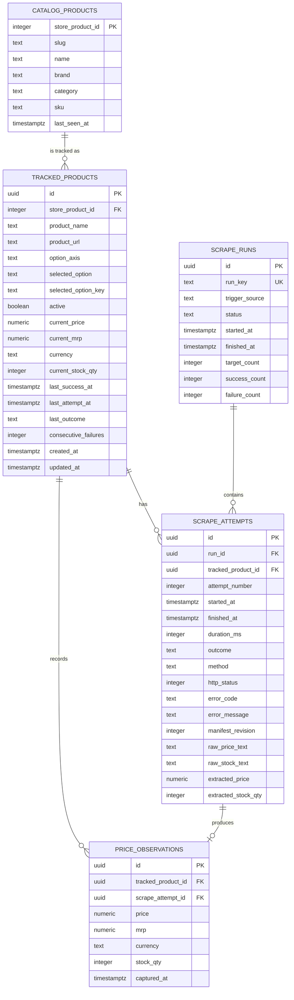

# Database Design

## 1. Database Choice

PostgreSQL on Supabase is required by the assignment.

The schema is relational because a tracking target has a stable identity, while scrape runs and observations form a one-to-many history.

Access model: **server-side only.** The Express backend connects with `pg` using the Supabase **session pooler** connection string (the direct connection is IPv6-only and Render cannot reach it). The browser never talks to Supabase directly. Multi-statement transactions (§10) need a real SQL connection, which `supabase-js` does not provide.

## 2. Entity Relationship Diagram



## 3. Table: `catalog_products`

Purpose: local copy of the store catalog so search is complete and fast.

Needed because `/api/v2/listings` has no working search and returns a different random order on every request. Paging through it live misses products (one full pass found 617 of 960).

| Column | Type | Notes |
|---|---|---|
| `store_product_id` | integer | PK, store `id` (also in `/item/<id>`) |
| `slug` | text | |
| `name` | text | Searched with `ILIKE` |
| `brand` | text | Searched with `ILIKE` |
| `category` | text | |
| `sku` | text | |
| `last_seen_at` | timestamptz | Last sync that returned it |

## 4. Table: `tracked_products`

Purpose: what the user tracks, plus the latest known good state.

| Column | Type | Notes |
|---|---|---|
| `id` | uuid | PK |
| `store_product_id` | integer | Store ID from `/item/<id>` (the CSV `product_id`) |
| `product_name` | text | Snapshot of product name |
| `product_url` | text | `https://demo.inelabteamdev.com/item/<id>` |
| `option_axis` | text | e.g. `Finish`, `Storage` |
| `selected_option` | text | Option label, e.g. `Oak` |
| `selected_option_key` | text | Store option id, e.g. `o1` |
| `active` | boolean | Soft delete |
| `current_price` | numeric(12,2) | Last successful price only |
| `current_mrp` | numeric(12,2) | Last successful MRP, nullable |
| `currency` | text | e.g. `INR` |
| `current_stock_qty` | integer | Last successful stock count, 0 = sold out |
| `last_success_at` | timestamptz | Last validated observation |
| `last_attempt_at` | timestamptz | Last attempt regardless of outcome |
| `last_outcome` | text | `success` / `retried` / `failed` |
| `consecutive_failures` | integer | Final failures since last success |
| `created_at` | timestamptz | Default now |
| `updated_at` | timestamptz | Updated by backend |

## 5. Table: `scrape_runs`

Purpose: batch-level execution metadata.

| Column | Type | Notes |
|---|---|---|
| `id` | uuid | PK |
| `run_key` | text | Unique idempotency key: `cron-<UTC 2h slot>` e.g. `cron-2026-09-25T10`; other sources use `<source>-<uuid>` (`manual-…`, `initial-…`, `demo-…`) |
| `trigger_source` | text | `cron`, `manual`, `initial`, `demo` |
| `status` | text | `running`, `completed`, `partial`, `failed` (a run stuck `running` >30 min is closed as `failed` by the next run) |
| `started_at` | timestamptz | UTC |
| `finished_at` | timestamptz | UTC |
| `target_count` | integer | Targets selected |
| `success_count` | integer | Targets that ended in success |
| `failure_count` | integer | Targets that ended in failure |

## 6. Table: `scrape_attempts`

Purpose: the source of truth for every attempt. Required because failures must not be hidden.

| Column | Type | Notes |
|---|---|---|
| `id` | uuid | PK |
| `run_id` | uuid | FK → scrape_runs |
| `tracked_product_id` | uuid | FK → tracked_products |
| `attempt_number` | integer | 1..N within the run |
| `started_at` | timestamptz | UTC; used as CSV timestamp |
| `finished_at` | timestamptz | UTC |
| `duration_ms` | integer | |
| `outcome` | text | `success`, `retried`, `failed` |
| `method` | text | `browser` (price) / `http` |
| `http_status` | integer | Nullable |
| `error_code` | text | e.g. `TIMEOUT`, `UPSTREAM_5XX`, `RATE_LIMITED`, `CHALLENGE_TIMEOUT`, `STRUCTURE_CHANGED`, `OPTION_NOT_FOUND`, `VALIDATION_FAILED` |
| `error_message` | text | Nullable |
| `manifest_revision` | integer | Store UI manifest revision seen, for diagnosing page shifts |
| `raw_price_text` | text | Diagnostic only |
| `raw_stock_text` | text | Diagnostic only |
| `extracted_price` | numeric(12,2) | Set only on success |
| `extracted_stock_qty` | integer | Set only on success |

Do not store full HTML. Save DOM snapshots/screenshots only locally while debugging.

## 7. Table: `price_observations`

Purpose: clean history used by the chart. Inserted only after validation succeeds.

| Column | Type |
|---|---|
| `id` | uuid PK |
| `tracked_product_id` | uuid FK |
| `scrape_attempt_id` | uuid FK, unique |
| `price` | numeric(12,2) |
| `mrp` | numeric(12,2), nullable |
| `currency` | text |
| `stock_qty` | integer |
| `captured_at` | timestamptz |

## 8. Integrity Rules

1. **A failed or retried attempt does not create an observation.**
2. **A failed attempt does not overwrite current state.** If `current_price = 12999.00`, `current_stock_qty = 7`, a failure leaves both unchanged.
3. **A success updates observation + current state in one transaction** (§10). If the transaction fails, nothing is partially committed.
4. **Only successful attempts carry price/stock** (enforced by a CHECK constraint).

## 9. Schema (`backend/db/schema.sql`)

```sql
create extension if not exists pgcrypto;

create table catalog_products (
  store_product_id integer primary key,
  slug             text not null,
  name             text not null,
  brand            text,
  category         text,
  sku              text,
  last_seen_at     timestamptz not null default now()
);

create table tracked_products (
  id                   uuid primary key default gen_random_uuid(),
  store_product_id     integer not null,
  product_name         text not null,
  product_url          text not null,
  option_axis          text,
  selected_option      text not null,
  selected_option_key  text not null,
  active               boolean not null default true,
  current_price        numeric(12,2) check (current_price > 0),
  current_mrp          numeric(12,2) check (current_mrp > 0),
  currency             text,
  current_stock_qty    integer check (current_stock_qty >= 0),
  last_success_at      timestamptz,
  last_attempt_at      timestamptz,
  last_outcome         text check (last_outcome in ('success','retried','failed')),
  consecutive_failures integer not null default 0,
  created_at           timestamptz not null default now(),
  updated_at           timestamptz not null default now()
);

-- Only one ACTIVE target per product+option; a soft-deleted target can be re-tracked
-- (the API reactivates the existing row instead of inserting a new one).
create unique index uq_tracked_active_target
  on tracked_products (store_product_id, selected_option_key)
  where active;

create table scrape_runs (
  id             uuid primary key default gen_random_uuid(),
  run_key        text not null unique,
  trigger_source text not null check (trigger_source in ('cron','manual','initial','demo')),
  status         text not null default 'running'
                 check (status in ('running','completed','partial','failed')),
  started_at     timestamptz not null default now(),
  finished_at    timestamptz,
  target_count   integer not null default 0,
  success_count  integer not null default 0,
  failure_count  integer not null default 0
);

create table scrape_attempts (
  id                  uuid primary key default gen_random_uuid(),
  run_id              uuid not null references scrape_runs(id),
  tracked_product_id  uuid not null references tracked_products(id),
  attempt_number      integer not null check (attempt_number >= 1),
  started_at          timestamptz not null,
  finished_at         timestamptz,
  duration_ms         integer,
  outcome             text not null check (outcome in ('success','retried','failed')),
  method              text not null default 'browser' check (method in ('browser','http')),
  http_status         integer,
  error_code          text,
  error_message       text,
  manifest_revision   integer,
  raw_price_text      text,
  raw_stock_text      text,
  extracted_price     numeric(12,2),
  extracted_stock_qty integer,
  unique (tracked_product_id, run_id, attempt_number),
  -- price/stock present if and only if success
  check (
    (outcome = 'success'  and extracted_price > 0 and extracted_stock_qty >= 0)
    or
    (outcome <> 'success' and extracted_price is null and extracted_stock_qty is null)
  )
);

create table price_observations (
  id                 uuid primary key default gen_random_uuid(),
  tracked_product_id uuid not null references tracked_products(id),
  scrape_attempt_id  uuid not null unique references scrape_attempts(id),
  price              numeric(12,2) not null check (price > 0),
  mrp                numeric(12,2) check (mrp > 0),
  currency           text not null,
  stock_qty          integer not null check (stock_qty >= 0),
  captured_at        timestamptz not null
);

create index idx_catalog_name on catalog_products (lower(name));
create index idx_tracked_active on tracked_products (active);
create index idx_obs_target_time on price_observations (tracked_product_id, captured_at desc);
create index idx_attempts_target_time on scrape_attempts (tracked_product_id, started_at desc);
create index idx_attempts_run on scrape_attempts (run_id);

-- Server-side access only: enable RLS with no policies so the public anon key can read nothing.
alter table catalog_products   enable row level security;
alter table tracked_products   enable row level security;
alter table scrape_runs        enable row level security;
alter table scrape_attempts    enable row level security;
alter table price_observations enable row level security;
```

The backend connects as the database owner through the pooler, so RLS does not block it. RLS only closes the Supabase auto-generated REST API to the public. [Supabase Row Level Security](https://supabase.com/docs/guides/database/postgres/row-level-security)

## 10. Transactions

### Successful attempt

```text
BEGIN
1. INSERT scrape_attempts (outcome = success, extracted_price, extracted_stock_qty)
2. INSERT price_observations
3. UPDATE tracked_products SET current_price, current_mrp, currency, current_stock_qty,
     last_success_at, last_attempt_at, last_outcome = 'success', consecutive_failures = 0
COMMIT
```

### Retried attempt

```text
INSERT scrape_attempts (outcome = retried, error_code, error_message)
UPDATE tracked_products SET last_attempt_at, last_outcome = 'retried'
```

### Final failed attempt

```text
BEGIN
1. INSERT scrape_attempts (outcome = failed, error_code, error_message)
2. UPDATE tracked_products SET last_attempt_at, last_outcome = 'failed',
     consecutive_failures = consecutive_failures + 1
   -- current_price / current_stock_qty NOT touched
COMMIT
```

## 11. CSV Query

One row per attempt, including retried and failed attempts:

```sql
select
  tp.store_product_id  as product_id,
  tp.product_name,
  tp.selected_option,
  sa.started_at        as timestamp,
  sa.extracted_price   as price,      -- null unless success (CHECK constraint)
  sa.extracted_stock_qty as stock,    -- null unless success
  sa.outcome
from scrape_attempts sa
join tracked_products tp on tp.id = sa.tracked_product_id
order by sa.started_at asc, sa.attempt_number asc;
```

The application formats `timestamp` with `toISOString()` (ISO 8601 UTC, `Z` suffix) and writes nulls as empty cells.
